# Lab SOC / Active Directory

Laboratoire personnel de détection d'attaques Active Directory, monté sur un mini-PC de récupération.
Un domaine Windows volontairement vulnérable, isolé derrière un pare-feu, surveillé par un SIEM —
puis attaqué, et enfin détecté par des règles écrites pour l'occasion.

> **Réalisé par :** Aymane el hasnaoui — étudiant Cyber 2A, EPITA — septembre 2026.
> **Dépôt :** https://github.com/Makarinoo/soc-ad-lab

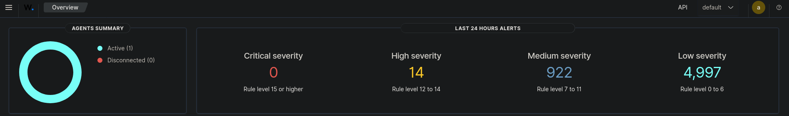

---

## Objectif

Reproduire à petite échelle la chaîne de travail d'un analyste SOC :

1. **Construire** un système d'information d'entreprise crédible — domaine AD, pare-feu, segmentation.
2. **Y introduire des failles réalistes**, celles que l'on rencontre vraiment en audit.
3. **Les exploiter** depuis une machine d'attaque.
4. **Les détecter** dans un SIEM, puis écrire les règles de détection correspondantes.

L'intérêt n'est pas d'empiler des outils, mais de **relier une action offensive à sa trace défensive**.

---

## Architecture

```
                    Internet
                       │
              Box FAI — 192.168.0.0/24
                       │
        ┌──────────────┴───────────────┐
        │   Proxmox VE 9.2  (pve)      │   192.168.0.200
        │   HP EliteDesk 705 G4        │
        │   Ryzen 5 2400GE · 32 Go     │
        └──────────────┬───────────────┘
                       │ vmbr0  (réseau domestique)
                 ┌─────┴──────┐
                 │  OPNsense  │  WAN 192.168.0.201
                 │    fw01    │  LAN 10.10.10.1
                 └─────┬──────┘
                       │ vmbr1  (réseau du lab, isolé — aucun port physique)
      ┌────────────┬─────┴──────┬────────────┐
 ┌────┴────┐  ┌────┴────┐  ┌────┴────┐  ┌────┴────┐
 │  DC01   │  │  WAZUH  │  │ CLIENT01│  │  KALI   │
 │   .10   │  │   .20   │  │  (DHCP) │  │  (DHCP) │
 │ AD + DNS│  │  SIEM   │  │ Win11 + │  │attaquant│
 │         │  │         │  │ Sysmon  │  │         │
 └─────────┘  └─────────┘  └─────────┘  └─────────┘
```

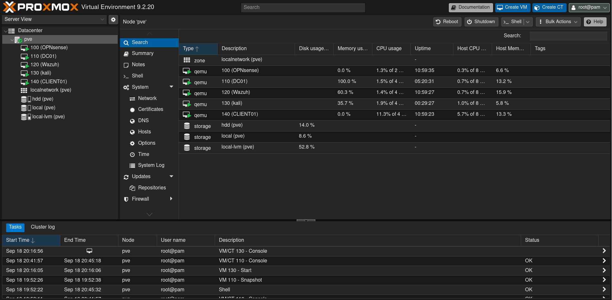

L'état final : cinq machines virtuelles en fonctionnement sur un seul mini-PC, et les trois stockages
séparés — `local-lvm` à 52 % pour les disques système, `hdd` à 14 % pour les ISO, les sauvegardes et
les VM secondaires.

**Le réseau du lab n'est relié à aucune carte physique.** Tout son trafic passe obligatoirement par
OPNsense, ce qui permet d'observer — et plus tard de bloquer — chaque flux.

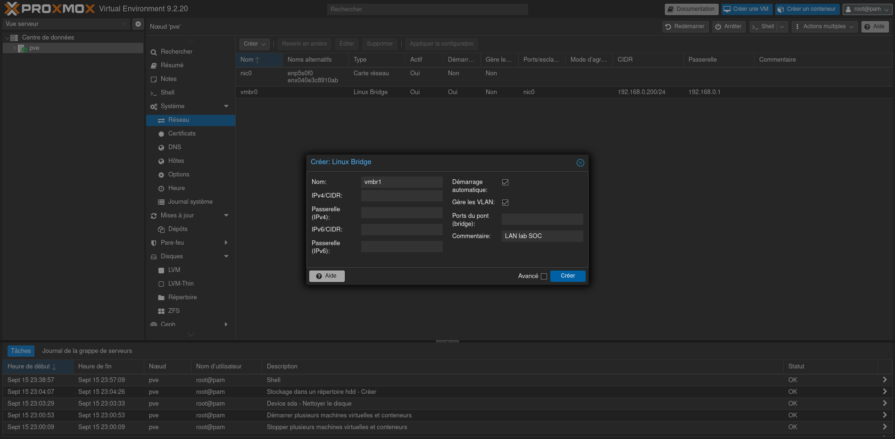

### Plan d'adressage

| Plage | Usage |
|---|---|
| `10.10.10.1` | OPNsense — passerelle, DHCP, DNS de secours |
| `10.10.10.10` | DC01 — contrôleur de domaine et DNS du domaine |
| `10.10.10.20` | Wazuh — SIEM |
| `10.10.10.100` → `.199` | Plage DHCP — **CLIENT01** (`.196`) et la machine d'attaque (`.190`) |

Le DHCP distribue l'option 6 (`10.10.10.10`) et l'option 15 (`ad.lab.internal`) : toute machine du lab
trouve le contrôleur de domaine sans configuration manuelle.

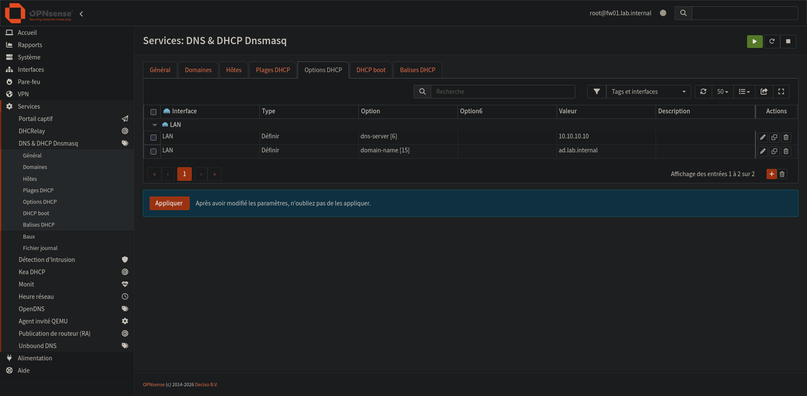

### Inventaire

| VM | Rôle | OS | vCPU / RAM | Stockage |
|---|---|---|---|---|
| `fw01` | Pare-feu, routage, DHCP, DNS | OPNsense 26.7 (FreeBSD 15.1) | 2 / 2 Go | SSD 20 Go |
| `DC01` | Contrôleur de domaine `ad.lab.internal` | Windows Server 2022 (éval.) | 4 / 4 Go | SSD 60 Go |
| `WAZUH` | SIEM — indexer, server, dashboard | Ubuntu Server 24.04 LTS | 4 / 8 Go | SSD 60 Go |
| `CLIENT01` | Poste utilisateur du domaine, instrumenté **Sysmon** | Windows 11 Enterprise (éval.) | 4 / 4 Go | HDD 60 Go |
| `KALI` | Machine d'attaque | Kali Linux 2026.2 | 4 / 4 Go | HDD 40 Go |

Les deux postes Windows et le SIEM remontent leurs journaux à Wazuh ; seul `CLIENT01` dispose en plus
de **Sysmon**, qui journalise les créations de processus avec leur ligne de commande complète.

---

## 1. Hyperviseur

Proxmox VE 9.2 installé en remplacement de Windows 11 Pro. Dépôts sans abonnement, système à jour,
**double authentification TOTP sur le compte `root`**, et séparation stricte des stockages : la
partition système ne reçoit ni disque de VM ni sauvegarde, pour ne jamais risquer de la saturer.

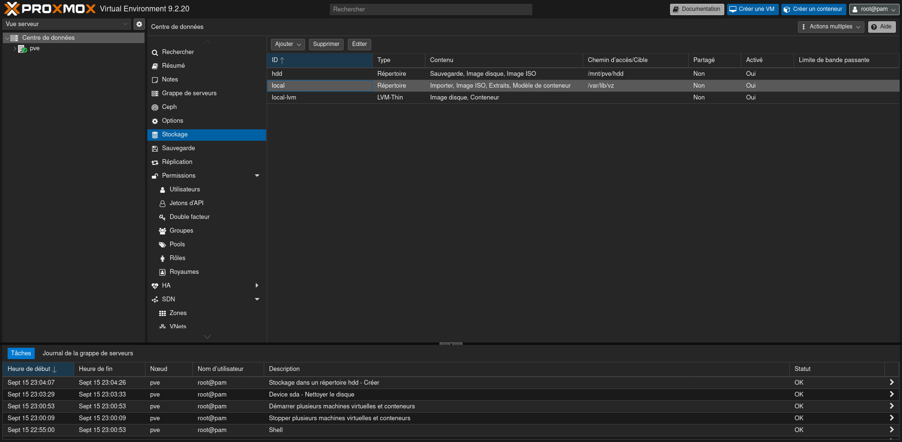

## 2. Segmentation réseau

OPNsense fait office de passerelle du lab, avec du NAT vers l'extérieur, un serveur DHCP et un
résolveur DNS Unbound validant DNSSEC.

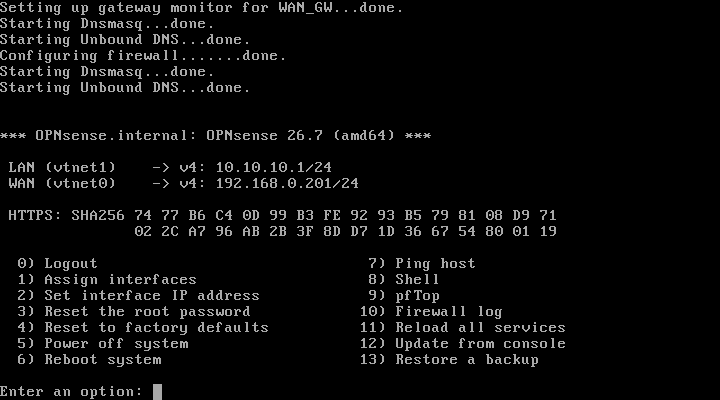

L'accès à l'interface d'administration est restreint par une règle explicite : **un hôte, un port**.
La source est un alias contenant le poste d'administration et l'hyperviseur, la destination l'adresse
WAN sur le port 443 uniquement, avec journalisation.

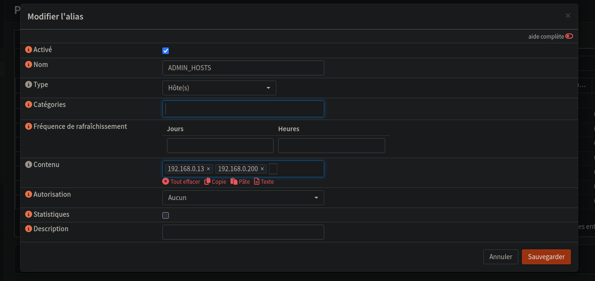

Conséquence visible : **le pare-feu ne répond pas au ping**. Un scan de découverte classique conclut
que l'hôte n'existe pas, alors que l'interface d'administration reste accessible aux deux machines
autorisées.

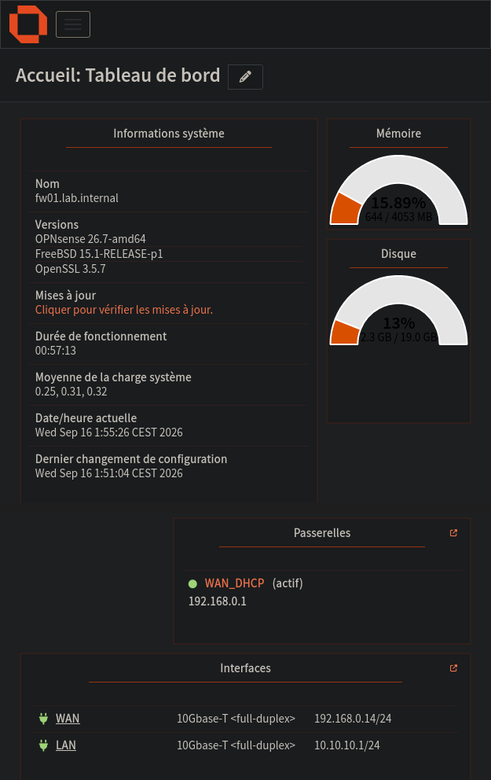

*(Capture prise juste après l'assistant de configuration : le WAN y est encore en DHCP, avant son
passage en adresse fixe `192.168.0.201`.)*

## 3. Contrôleur de domaine

Forêt `ad.lab.internal` (NetBIOS `AD`), DNS intégré à l'annuaire, avec un redirecteur vers OPNsense
pour la résolution externe.

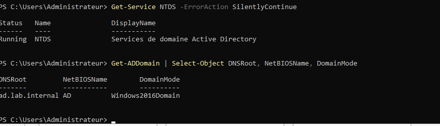

Santé du contrôleur vérifiée après promotion : partages **SYSVOL** et **NETLOGON** publiés, services
`NTDS`, `Netlogon` et `DFSR` démarrés, et surtout l'**événement 4602** qui confirme la fin de la
synchronisation initiale de SYSVOL.

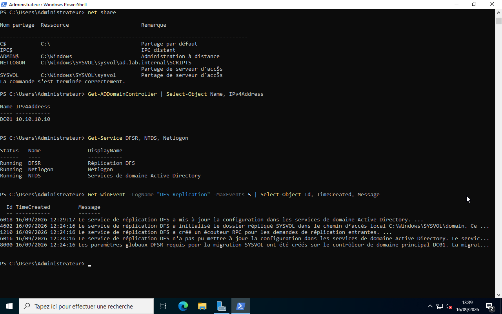

> À noter : `dcdiag` signale un échec du test **DFSREvent** juste après la promotion. C'est un faux
> positif — le test remonte tout avertissement DFSR des 24 dernières heures, or ceux-ci datent de la
> promotion elle-même. La preuve de bonne santé est l'événement 4602, pas le verdict de l'outil.

## 4. Peuplement de l'annuaire — les failles volontaires

Unités d'organisation, six utilisateurs répartis par service, quatre groupes métier. Puis **quatre
faiblesses introduites délibérément**, chacune correspondant à une attaque réelle :

| Configuration | Faiblesse | Attaque visée | Détection attendue |
|---|---|---|---|
| `svc_sql` — SPN `MSSQLSvc/dc01…:1433`, mot de passe faible | Compte de service kerberoastable | **Kerberoasting** | Événement 4769 en RC4 |
| `jdurand` — pré-authentification Kerberos désactivée | Ticket obtenable sans authentification | **AS-REP Roasting** | Événement 4768, `preAuthType 0` |
| `sbernard` — mot de passe inscrit dans la Description | Secret lisible par tout utilisateur du domaine | **Énumération LDAP** | Difficile — voir plus bas |
| `pmoreau` — compte du support dans « Admins du domaine » | Compte sur-privilégié | **DCSync** | Événement 4662 |

> ⚠️ **Ces faiblesses sont intentionnelles et pédagogiques.** Le réseau est isolé, sans exposition
> depuis Internet, et les mots de passe visibles sur les captures n'ont aucune valeur en dehors de ce
> lab.

## 5. SIEM

Wazuh 4.14 déployé en un seul serveur — *indexer*, *server* et *dashboard*. L'agent installé sur DC01
remonte les journaux de sécurité Windows.

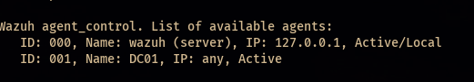

**Ligne de base avant toute attaque :** 0 alerte critique au sens des règles Wazuh. Les alertes
« Critical » visibles dans le tableau de bord proviennent du module de **détection de vulnérabilités**
— DC01 est volontairement laissé sans correctifs — et non de règles de détection. Deux échelles
distinctes qu'il faut savoir différencier.

## 6. Accès distant

Un VPN maillé **Tailscale** est installé sur l'hyperviseur et sur le SIEM. Le tableau de bord est
joignable depuis n'importe où, **alors qu'aucune route n'existe entre le réseau domestique et le
réseau du lab**. Seul le tunnel chiffré traverse, et **aucun port n'est ouvert sur la box**.

> **Une nuance à assumer :** ce tunnel crée un chemin qui **contourne OPNsense**. Le SIEM devient
> joignable sans passer par le pare-feu du lab, donc l'affirmation « tout le trafic passe par
> OPNsense » vaut pour les échanges *entre machines du lab*, pas pour cet accès d'administration.
> L'exposition reste limitée — seuls mes propres appareils, authentifiés sur le tailnet, atteignent
> la VM, et des ACL Tailscale permettent de restreindre encore — mais c'est une entorse à la
> segmentation, et elle mérite d'être écrite plutôt que passée sous silence.

---

## 7. Attaque : Kerberoasting

Depuis la machine Kali, qui obtient son adresse et son DNS du lab par DHCP :

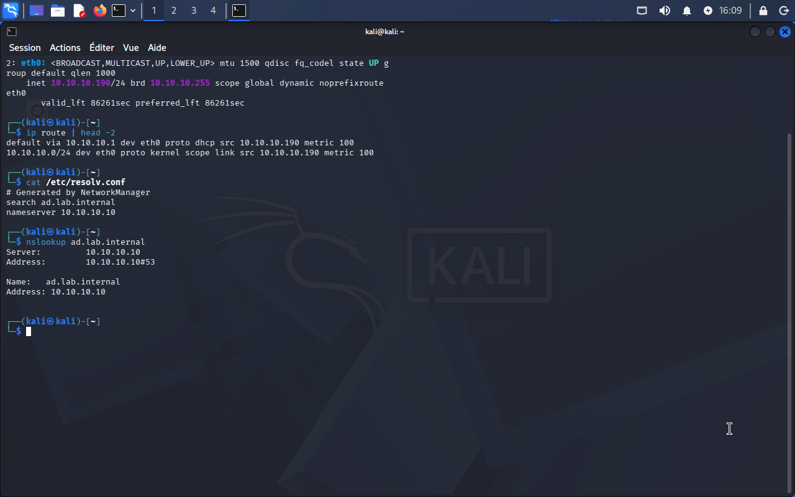

**Reconnaissance** — les ports 88 (Kerberos) et 389 (LDAP) signent un contrôleur de domaine :

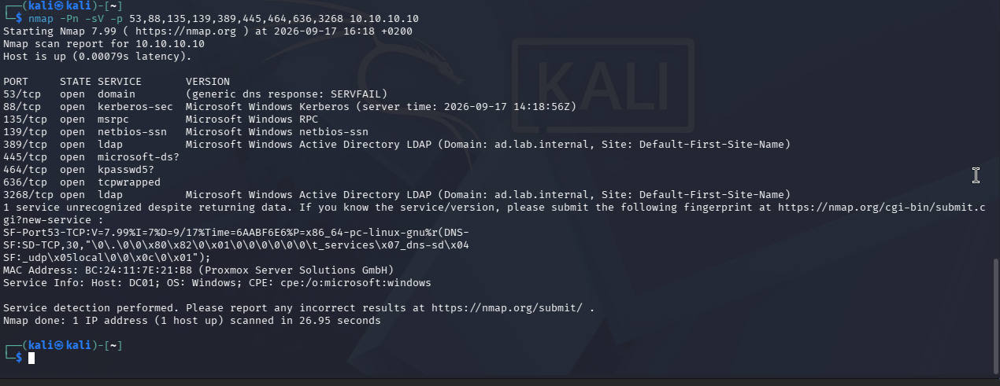

**Énumération authentifiée** avec un simple compte utilisateur, comme en aurait un attaquant après un
phishing réussi. On y lit déjà le mot de passe laissé dans la description de `sbernard` :

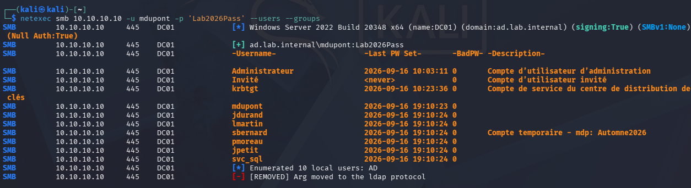

**Kerberoasting** — n'importe quel utilisateur du domaine peut demander un ticket de service pour un
compte portant un SPN. Ce ticket est chiffré avec le mot de passe du compte de service :

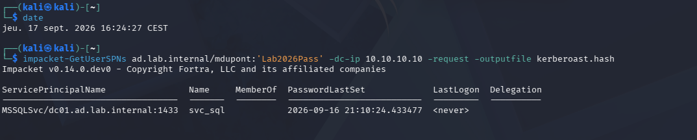

**Cassage hors ligne** — le hash tombe en moins d'une seconde. Le format `krb5tgs, etype 23
[MD4 HMAC-MD5 RC4]` confirme le chiffrement RC4, signature de l'attaque :

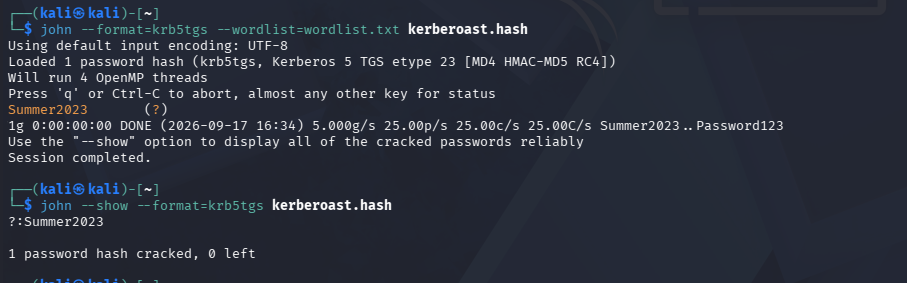

> **Le point important :** le cassage se fait **hors ligne**. Le contrôleur de domaine n'en voit
> rien. La seule trace exploitable est la demande de ticket elle-même.

---

## 8. Détection : écrire la règle

Un contrôleur de domaine émet des milliers de 4769 légitimes par jour. Wazuh les classe donc comme du
bruit et n'alerte pas dessus. Toute la difficulté consiste à **isoler le signal** : ici, le
chiffrement **RC4 (`0x17`)**, alors que Windows utilise normalement AES (`0x12`).

```xml
<rule id="100100" level="12">
  <if_sid>60103</if_sid>
  <field name="win.system.eventID">^4769$</field>
  <field name="win.eventdata.ticketEncryptionType">^0x17$</field>
  <field name="win.eventdata.serviceName" negate="yes" type="pcre2">(\$$|^krbtgt$)</field>
  <description>Kerberoasting possible : ticket Kerberos RC4 demande pour
               $(win.eventdata.serviceName) depuis $(win.eventdata.ipAddress)</description>
  <mitre>
    <id>T1558.003</id>
  </mitre>
</rule>
```

La dernière condition écarte les **comptes machine** (`serviceName` finissant par `$`) et **`krbtgt`** :
tous deux demandent légitimement des tickets, parfois en RC4, et sans cette exclusion la règle
produirait du bruit en continu.

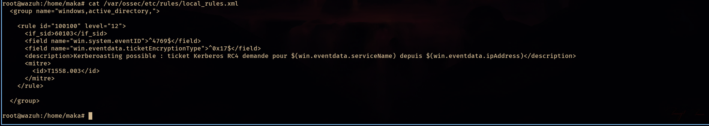

**Résultat** — l'attaque déclenche l'alerte, avec le service visé et l'adresse de l'attaquant
directement dans la description :

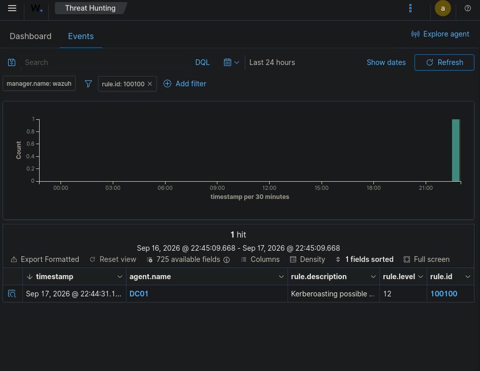

Trois détections maison, mappées MITRE ATT&CK :

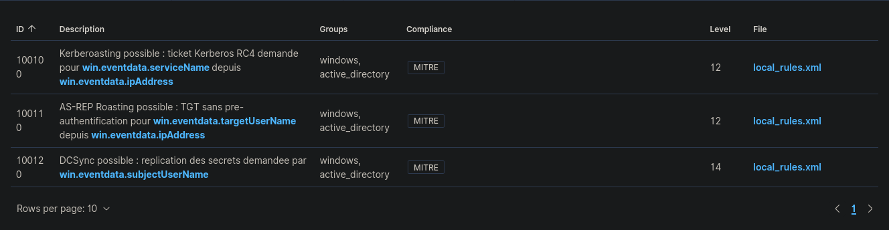

| Règle | Détection | Technique |
|---|---|---|
| `100100` | Ticket de service Kerberos demandé en RC4 | **T1558.003** |
| `100110` | TGT demandé sans pré-authentification | **T1558.004** |
| `100120` | Réplication des secrets demandée par un compte **non-machine** | **T1003.006** |

### Pourquoi cette règle n'a pas marché du premier coup

Elle semblait juste, et pourtant elle ne se déclenchait jamais. Deux heures de diagnostic ont permis
d'éliminer, dans l'ordre : la syntaxe XML, les droits du fichier, le chargement des règles, une liste
de filtrage CDB, le mode debug d'`analysisd`, et `wazuh-logtest` — inutilisable ici, car il décode le
JSON brut avec le mauvais décodeur.

**Deux causes réelles, toutes deux liées au moteur de règles :**

1. **Une règle de test trop large, placée avant la règle spécifique, la masquait.** Dans Wazuh, les
   règles sœurs sont évaluées dans l'ordre du fichier et **une seule gagne par événement**. Règle
   d'or : du plus spécifique au plus général.
2. **Le mauvais parent.** La chaîne Windows est
   `60000` → `60001` (canal Security) → `60103` (audit réussi) → `60106`. Or `60106` ne capte pas les
   tickets RC4. En chaînant la règle sur **`60103`** au lieu de `60106`, elle s'est déclenchée
   immédiatement.

Le test qui a tranché : deux règles identiques, greffées à deux étages différents. Celle greffée sur
`60103` a produit deux alertes, celle sur `60001` aucune.

---

---

## 9. Les deux autres attaques

### AS-REP Roasting

`jdurand` n'exige pas de pré-authentification Kerberos. Conséquence : **sans le moindre identifiant**,
une simple liste de noms suffit à obtenir un élément chiffré avec son mot de passe. Les six autres
comptes sont correctement configurés et l'outil les écarte un à un.

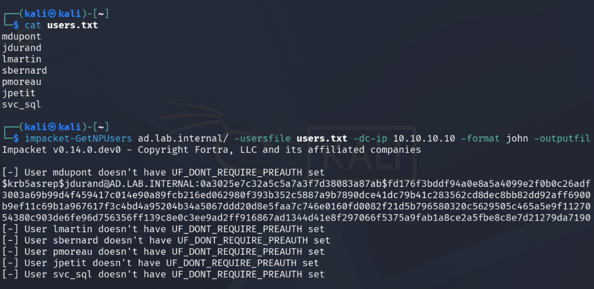

Le hash tombe aussitôt. La détection, elle, repose sur un champ sans ambiguïté : **`preAuthType 0`**
dans l'événement **4768**.

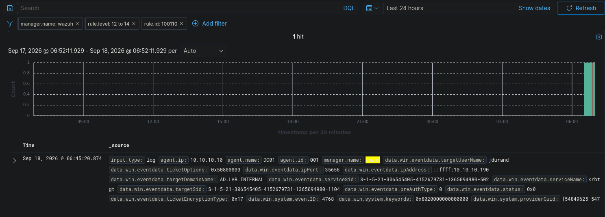

### DCSync — la compromission totale

`pmoreau`, compte du support placé à tort dans les admins du domaine, peut demander au contrôleur de
**répliquer** les secrets de l'annuaire, comme le ferait un autre contrôleur. La méthode **DRSUAPI**
livre l'empreinte du compte **`krbtgt`** et ses clés Kerberos : de quoi forger des tickets d'or et
conserver un accès administrateur au domaine même après un changement de mots de passe.

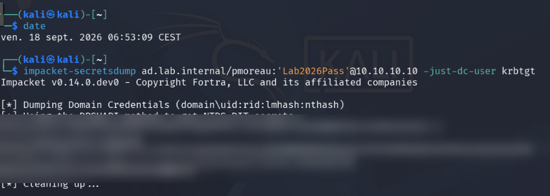

*(Empreinte NTLM et clés Kerberos de `krbtgt` masquées : cette commande expose les secrets du
domaine. Le mot de passe visible est celui du lab, volontairement faible et documenté comme tel.)*

Six événements **4662** sont remontés, portant le GUID **`1131f6aa-9c07-11d1-f79f-00c04fc2dcd2`** —
le droit **DS-Replication-Get-Changes**.

⚠️ **Nuance importante :** ce droit seul ne signe pas un DCSync. Il est aussi utilisé par la
réplication légitime entre contrôleurs. Le droit réellement discriminant est
**`1131f6ad-9c07-11d1-f79f-00c04fc2dcd2`** — *DS-Replication-Get-Changes-All*, celui qui donne accès
aux **secrets**. La règle retient donc les deux et, surtout, **exclut les comptes machine** : sans
cette exclusion, chaque réplication entre DC déclencherait l'alerte.

```xml
<rule id="100120" level="14">
  <if_sid>60103</if_sid>
  <field name="win.system.eventID">^4662$</field>
  <field name="win.eventdata.properties" type="pcre2">1131f6a[ad]-9c07-11d1-f79f-00c04fc2dcd2</field>
  <field name="win.eventdata.subjectUserName" negate="yes" type="pcre2">\$$</field>
  <description>DCSync possible : replication des secrets demandee par $(win.eventdata.subjectUserName)</description>
  <mitre>
    <id>T1003.006</id>
  </mitre>
</rule>
```

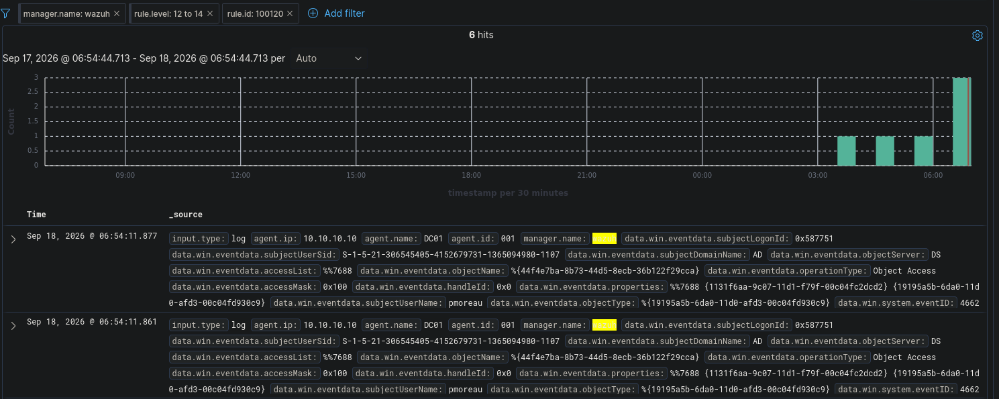

### Bilan

| Faille | Attaque | Détection | Résultat |
|---|---|---|---|
| `svc_sql` kerberoastable | Kerberoasting | `100100` — 4769 en RC4 | ✅ détectée |
| `jdurand` sans pré-auth | AS-REP Roasting | `100110` — 4768, `preAuthType 0` | ✅ détectée |
| `pmoreau` sur-privilégié | DCSync | `100120` — 4662, GUID de réplication | ✅ détectée |
| Mot de passe en Description | Énumération LDAP | — | ⚠️ non détectable sans audit LDAP |

**Trois attaques sur quatre laissent une trace exploitable.** La quatrième est la plus instructive :
lire l'annuaire est une opération parfaitement légitime, que Windows ne journalise pas par défaut. La
parade n'est pas dans la détection mais dans l'hygiène — ne jamais stocker de secret dans un champ
que tout utilisateur du domaine peut lire.

---

## 10. Le poste client : voir l'attaque depuis l'intérieur

Jusqu'ici, tout était observé depuis le contrôleur de domaine. Or un DC ne voit que ce qui le
concerne — des demandes de tickets, des authentifications. Il ignore **ce qui s'exécute réellement sur
les postes**. D'où **CLIENT01**, un Windows 11 joint au domaine et équipé de **Sysmon**.

Le poste trouve son domaine tout seul : le DHCP d'OPNsense lui donne l'adresse du contrôleur comme
serveur DNS et `ad.lab.internal` comme suffixe.

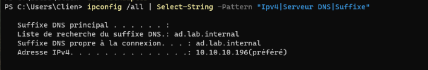

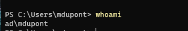

**Sysmon** est installé avec la configuration **SwiftOnSecurity**, la référence du domaine : elle
filtre le bruit de Windows pour ne garder que ce qui a une valeur en détection. L'agent Wazuh est
ensuite branché sur le canal `Microsoft-Windows-Sysmon/Operational` — sans cet ajout, Sysmon
journalise dans le vide, l'agent ne lisant par défaut que Security, System et Application.

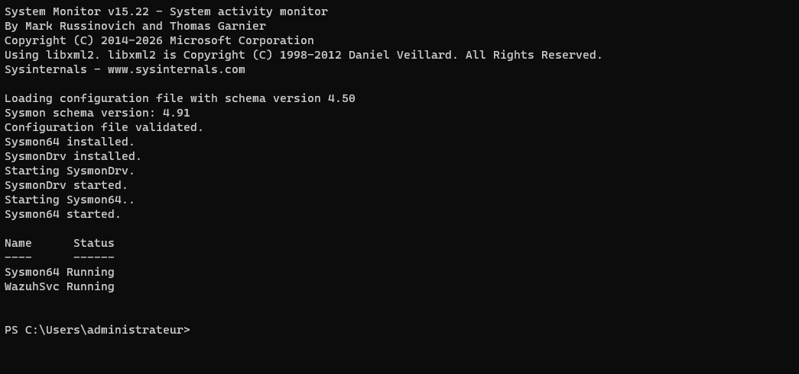

### Ce qu'un simple utilisateur peut faire

Les commandes suivantes ont été lancées depuis le compte **`mdupont`**, utilisateur standard sans
aucun privilège — exactement la situation d'un attaquant après un hameçonnage réussi.

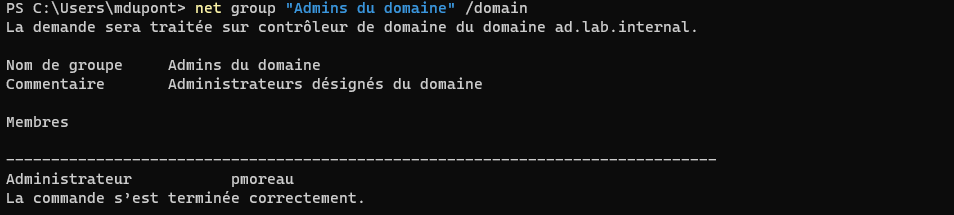

En une commande, l'annuaire livre la composition des administrateurs du domaine : `Administrateur` et
**`pmoreau`**. C'est le chemin d'attaque repéré plus haut, découvert ici *depuis le poste*, sans outil
particulier.

Puis une commande volontairement obfusquée, technique très répandue pour masquer une charge :

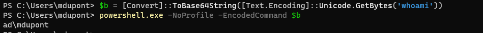

### Ce que Sysmon en fait

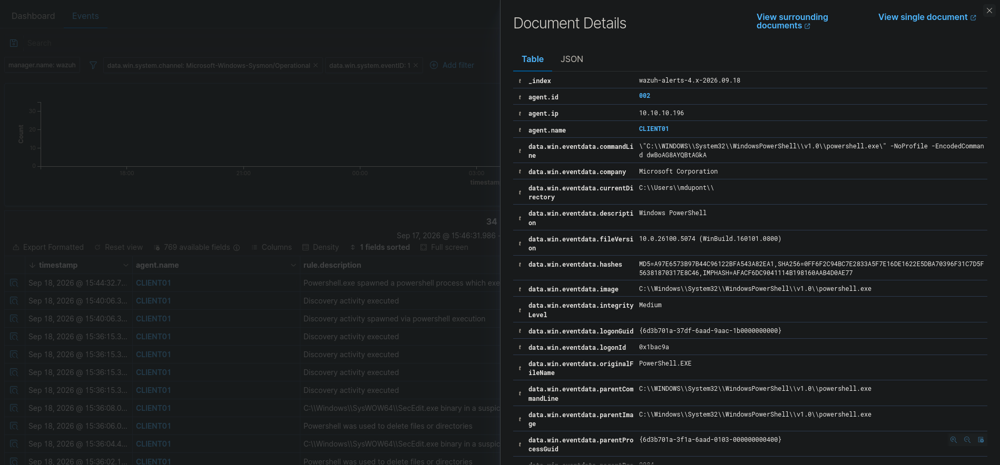

L'événement **Sysmon 1** livre ce que les journaux Windows classiques ne donnent pas :

| Champ | Valeur relevée |
|---|---|
| `commandLine` | `powershell.exe -NoProfile -EncodedCommand dwBoAG8AYQBtAGkA` |
| `parentImage` | `powershell.exe` — l'enchaînement des processus |
| `currentDirectory` | `C:\Users\mdupont` |
| `hashes` | MD5, SHA256 et IMPHASH du binaire |
| `integrityLevel` | Medium |

La chaîne `dwBoAG8AYQBtAGkA` est simplement `whoami` encodé en base64. Un analyste le décode en
quelques secondes — encore faut-il **avoir la ligne de commande**, ce que seul Sysmon fournit.

Et les règles natives de Wazuh se déclenchent d'elles-mêmes sur ces actions : *Discovery activity
executed*, *Discovery activity spawned via powershell execution*, *Powershell.exe spawned a powershell
process*. Le tableau de bord les classe directement dans MITRE ATT&CK.

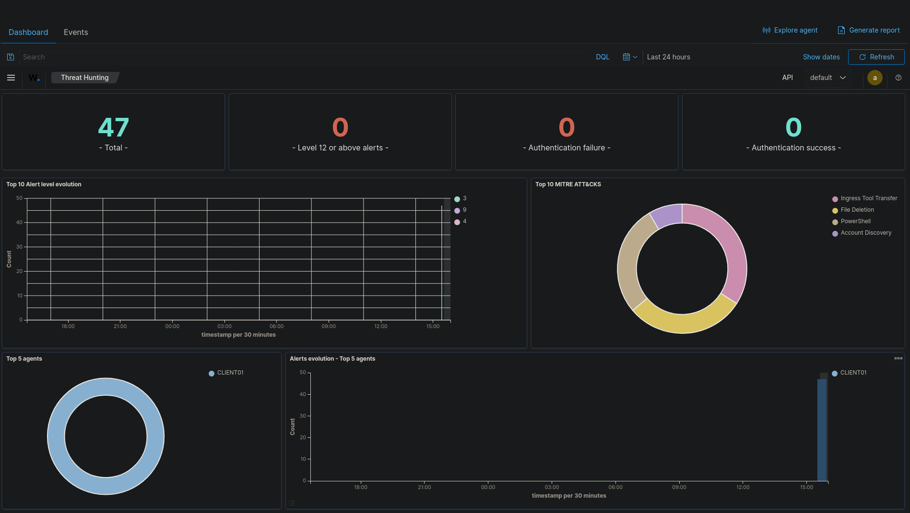

> **La leçon d'architecture :** le contrôleur de domaine dit *qu'une* authentification a eu lieu ; le
> poste dit *ce qui a été exécuté, par qui et depuis quel processus*. Une détection sérieuse a besoin
> des deux — c'est pour ça qu'un SOC instrumente les postes de travail et pas seulement les serveurs.

### Enrichir une détection plutôt que la dupliquer

Ma première règle sur le PowerShell encodé ne se déclenchait jamais. La cause : **Wazuh couvre déjà
le cas nativement**, avec la règle `92057`, dont l'expression régulière attrape toutes les
abréviations de l'option — `-e`, `-en`, `-enc`, `-encodedcommand`. Ma règle lui était *sœur*, donc
jamais évaluée.

La bonne réponse n'était pas d'écrire un doublon, mais de **greffer la mienne sur la sienne** :

```xml
<rule id="100130" level="14">
  <if_sid>92057</if_sid>
  <description>PowerShell obfusque : base64 execute par $(win.eventdata.user)
               sur $(win.eventdata.currentDirectory) - parent $(win.eventdata.parentImage)</description>
  <mitre>
    <id>T1027</id>
    <id>T1059.001</id>
  </mitre>
</rule>
```

La détection native passe ainsi du **niveau 9 au niveau 14**, gagne son **mapping MITRE**, et affiche
l'utilisateur, le répertoire courant et le processus parent directement dans l'alerte — un analyste
n'a plus à ouvrir l'événement pour décider.

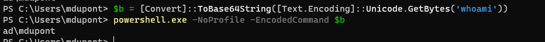

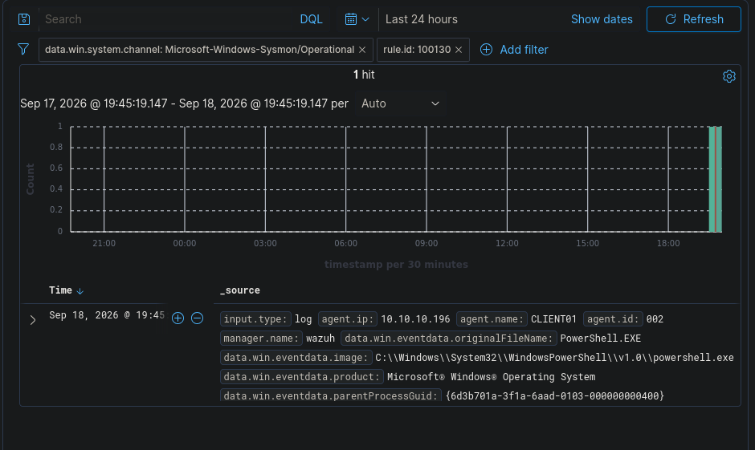

> **Le réflexe à garder :** avant d'écrire une règle, vérifier ce que le jeu natif couvre déjà. Un SOC
> qui empile des règles maison redondantes finit avec des alertes en double et une maintenance
> impossible.

### Les quatre règles maison

| Règle | Détection | Niveau | Technique |
|---|---|---|---|
| `100100` | Ticket de service Kerberos demandé en RC4 | 12 | T1558.003 |
| `100110` | TGT demandé sans pré-authentification | 12 | T1558.004 |
| `100120` | Réplication des secrets demandée par un compte non-machine | 14 | T1003.006 |
| `100130` | PowerShell encodé en base64 *(enrichissement de `92057`)* | 14 | T1027 · T1059.001 |

Les quatre règles sont versionnées ici : **[`rules/local_rules.xml`](rules/local_rules.xml)** — à
déposer dans `/var/ossec/etc/rules/` (propriétaire `wazuh:wazuh`, droits `660`), puis
`systemctl restart wazuh-manager`.

---

## 11. Durcissement : corriger, puis le prouver

Détecter une attaque ne vaut que si l'on sait aussi la rendre impossible. Les quatre faiblesses ont
donc été corrigées, puis **les trois attaques rejouées à l'identique**.

### Les correctifs

| Compte | Correctif appliqué | Pourquoi |
|---|---|---|
| `svc_sql` | Mot de passe de 24 caractères aléatoires **et `KerberosEncryptionType AES128,AES256`** | Le compte refuse désormais le RC4, et le mot de passe sort du domaine des attaques par dictionnaire |
| `jdurand` | `DoesNotRequirePreAuth` remis à `False` **et mot de passe réinitialisé** | Son empreinte AS-REP a été cassée : rétablir la pré-authentification ne protège pas un secret déjà connu |
| `sbernard` | Description nettoyée **et mot de passe réinitialisé** | Nettoyer le champ ne suffit pas : le secret a fuité, il est compromis |
| `pmoreau` | Retiré des « Admins du domaine », **mot de passe réinitialisé**, `adminCount` remis à `0` et héritage des ACL rétabli | Son mot de passe a servi au DCSync. Et le retrait du groupe ne suffit pas : `adminCount=1` et l'héritage désactivé sont laissés en place par **AdminSDHolder** |
| `krbtgt` | Mot de passe réinitialisé **deux fois** | Le DCSync avait exfiltré son empreinte, et un seul reset ne suffit pas (voir ci-dessous) |

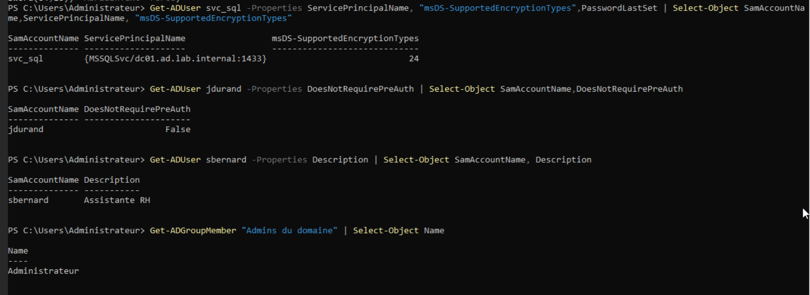

> **Pourquoi deux réinitialisations de `krbtgt`, y compris dans un lab :** Active Directory conserve
> la **clé précédente (N-1)** pour continuer d'accepter les tickets déjà émis. Après un seul reset, un
> ticket d'or forgé avec l'empreinte volée **reste donc valide**. Il en faut une seconde, une fois la
> première répliquée — dix heures d'intervalle au minimum en production, le temps d'un cycle de
> réplication et de l'expiration des tickets en cours.
>
> **Et une précision sur la commande :** le mot de passe fourni à `Set-ADAccountPassword` pour
> `krbtgt` est **ignoré** — le contrôleur en génère un aléatoire lui-même. Parler d'une « clé de
> 64 caractères » n'avait donc aucun sens, et j'ai corrigé la formulation.
>
> Pour un compte de service, enfin, la vraie réponse reste le **gMSA** : un mot de passe de
> 120 caractères géré et renouvelé par l'annuaire, que personne n'a jamais à connaître.

### Ce que ce lab ne fait pas, et qu'un incident réel imposerait

Mon DCSync n'a extrait qu'un seul compte (`-just-dc-user krbtgt`). **Un DCSync complet aurait livré
les empreintes NT de tout le domaine** — chaque utilisateur, chaque compte machine, chaque relation
d'approbation. La remédiation ne serait alors plus une liste de quatre comptes, mais une
**réinitialisation globale** : tous les utilisateurs, les comptes machine, les approbations, et
`krbtgt` deux fois.

Je ne l'ai pas fait ici, et c'est un choix assumé de lab. Mais confondre « j'ai corrigé les comptes
que j'ai attaqués » avec « le domaine est sain » serait l'erreur d'analyse la plus coûteuse après une
compromission réelle.

### Les mêmes attaques, rejouées

**Kerberoasting** — le ticket est toujours délivré, mais regarde son en-tête : **`$krb5tgs$18$`** au
lieu de `$krb5tgs$23$`. Le 18, c'est AES256.

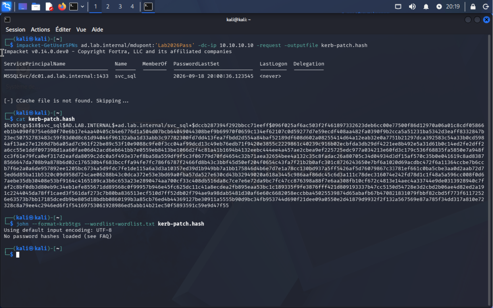

John répond *« No password hashes loaded »* : son format `krb5tgs` ne traite que le RC4. **Mais
l'échec de l'outil ne prouve rien** — hashcat casse très bien ce format, avec le mode **19700**
(TGS-REP AES256). Le ticket reste attaquable, simplement beaucoup plus cher : **RC4 repose sur
HMAC-MD5, testable des milliards de fois par seconde, là où AES256 dérive sa clé via PBKDF2 et
4096 itérations.**

Ce qui protège réellement `svc_sql`, ce n'est donc pas le refus de John ni même le passage en AES :
c'est son **mot de passe de 24 caractères aléatoires**, hors de portée d'une attaque par dictionnaire
comme par masque. Le chiffrement ne fait que renchérir chaque essai — encore faut-il qu'il y ait un
espace de recherche à parcourir.

**AS-REP Roasting** — plus aucun compte ne ressort :

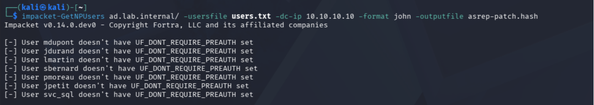

**DCSync** — la réplication est refusée, aucun secret n'est extrait :

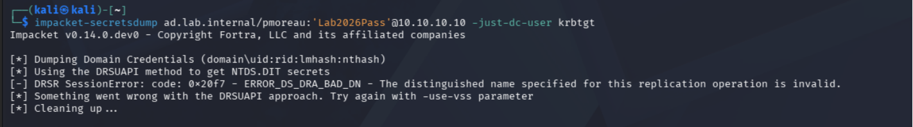

Pour écarter tout doute — l'échec vient-il du retrait de privilèges, ou d'un contrôleur défaillant ? —
la même commande a été relancée avec un **compte administrateur** : elle aboutit. La réplication
fonctionne donc toujours ; c'est bien `pmoreau` qui a perdu le droit de la demander.

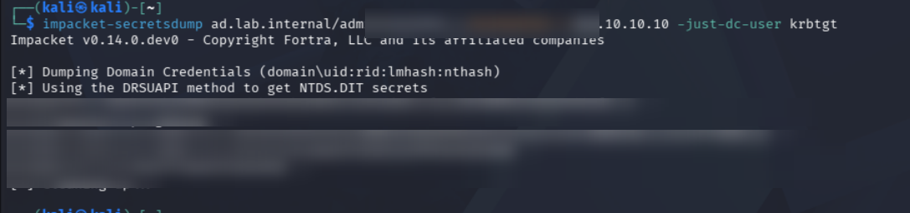

*(Mot de passe, empreinte NTLM et clés Kerberos masqués : cette commande expose les secrets du
domaine.)*

**Énumération LDAP** — il ne reste que des descriptions anodines :

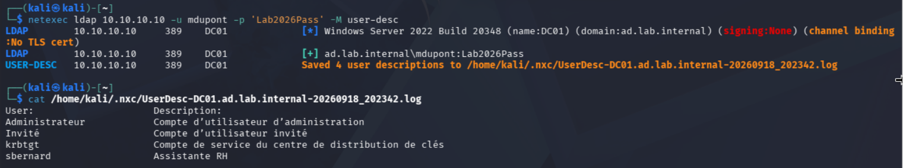

### Ce que le durcissement fait aux détections

Un point contre-intuitif mérite d'être noté : **la règle `100100` ne se déclenche plus.** Elle ciblait
les tickets RC4, or il n'en existe plus. Ce n'est pas une régression — la faille a disparu, donc la
détection qui la guettait n'a plus d'objet.

Mais le Kerberoasting, lui, reste possible : un attaquant peut toujours demander le ticket, simplement
il ne le cassera pas. **Une détection à jour ne surveillerait donc plus le chiffrement mais le
comportement** — par exemple un même compte qui réclame des tickets de service pour de nombreux SPN
en quelques secondes.

> **La leçon :** durcir un système déplace la surface d'attaque, et les règles de détection doivent
> suivre ce déplacement. Un SOC qui ne réexamine jamais ses règles après un durcissement surveille
> peu à peu des menaces qui n'existent plus.

---

## Problèmes rencontrés et résolus

Dans un lab, la valeur est autant dans le dépannage que dans le résultat.

| # | Symptôme | Cause réelle | Correction |
|---|---|---|---|
| 1 | Échec de gravure de la clé USB, puis clé illisible | Table de partition laissée à moitié écrite | `diskpart clean` puis écriture en mode DD |
| 2 | L'installateur proposait un réseau inattendu | Câble Ethernet mal enfoncé | Rebranchement |
| 3 | Erreur de certificat sur le miroir Proxmox | HTTPS mal configuré côté miroir | Aucune — les dépôts APT utilisent HTTP signé par GPG |
| 4 | Installateur OPNsense bloqué sur la RAM | 2 Go insuffisants pour l'image live | RAM portée à 4 Go le temps de l'installation |
| 5 | Interfaces WAN et LAN inversées | Attribution automatique arbitraire | Réattribution vérifiée par adresse MAC |
| 6 | Le pare-feu ne répondait pas à son adresse fixe | **L'IP saisie en console n'avait jamais été appliquée** | Reconfiguration via l'interface web |
| 7 | Perte d'accès après l'assistant | Le filtrage s'était réactivé, les règles WAN bloquant tout | Règle d'administration créée avant réactivation |
| 8 | Aucune passerelle proposée en IPv4 statique | La passerelle dynamique disparaît avec le DHCP | Passerelle recréée manuellement |
| 9 | DC01 sans passerelle | La VM du pare-feu était restée éteinte | **Règle du lab : OPNsense démarre toujours en premier** |
| 10 | Bloc de texte jamais terminé dans le terminal | Retour chariot `\r` hérité de Windows | `sed -i 's/\r$//'` |
| 11 | `dcdiag` en échec sur DFSREvent | Faux positif post-promotion | Vérification par l'événement 4602 |
| 12 | Installation de l'agent impossible à distance | Serveur HTTP temporaire **exposant tout le répertoire personnel**, archive de certificats Wazuh comprise | Serveur coupé, transfert par l'agent invité QEMU. ⚠️ Les certificats exposés **n'ont pas été régénérés** : hors lab, l'exposition imposerait de relancer `wazuh-certs-tool.sh` et de redéployer les agents |
| 13 | `msiexec` en erreur 1619 | `Invoke-WebRequest` échoue sous le compte système | Remplacé par `curl.exe` |
| 14 | Règle de détection sans effet | Règle large masquant la spécifique, puis mauvais parent (`60106` au lieu de `60103`) | Chaînage corrigé, ordre des règles revu |

### Le diagnostic dont je suis le plus satisfait

Le problème n° 6 a coûté cinq tests. L'interface affichait fièrement la bonne adresse, mais la carte
réseau portait encore l'ancienne. Le diagnostic n'a avancé qu'en distinguant les couches : **un échec
ARP (couche 2) ne se comporte pas comme un blocage pare-feu (couche 3)** — le premier renvoie « hôte
inaccessible », le second un simple silence.

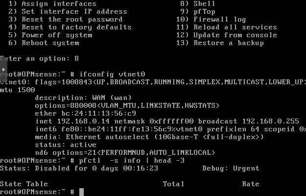

**La leçon :** ne jamais se fier à l'affichage de la configuration. `ifconfig` montre l'état réel de
l'interface, et c'est lui qui fait foi.

---

## Statut et suite

- [x] Exécution et détection du **Kerberoasting**, de l'**AS-REP Roasting** et du **DCSync**
- [x] Poste **CLIENT01** sous Windows 11 avec **Sysmon** et agent Wazuh
- [x] **Durcissement** des quatre faiblesses et rejeu des attaques pour le prouver
- [ ] Règle de détection **comportementale** du Kerberoasting (volume de tickets par compte)
- [ ] Compte de service en **gMSA** plutôt qu'un mot de passe statique
- [ ] Second contrôleur de domaine pour observer la réplication et les scénarios de bascule

---

## Compétences mises en œuvre

**Infrastructure** — hyperviseur bare metal, virtualisation matérielle, architecture de stockage.
**Réseau** — segmentation, routage, NAT, DHCP, DNS, VPN maillé, diagnostic méthodique par couches.
**Systèmes** — Active Directory, DNS intégré, PowerShell, Linux, FreeBSD.
**Offensif** — reconnaissance, énumération LDAP/SMB, Kerberoasting, cassage de hash.
**Défensif** — pare-feu au moindre privilège, MFA, SIEM, **ingénierie de détection**, MITRE ATT&CK.
